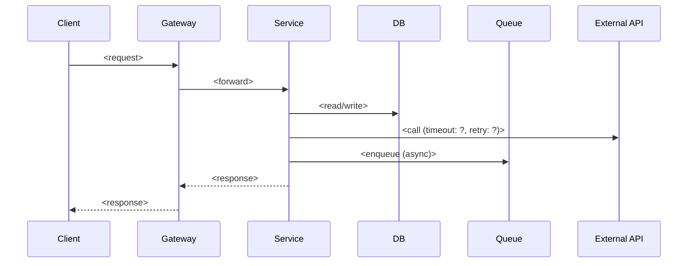

# API 명세

> 이 문서는 *처리 로직·개념·설계*의 권위 있는 기록이다.
> request/response 스키마는 변경이 잦으므로 **코드를 단일 진실(single source of truth)** 로 본다 — 본 문서에는 예시 1~2개까지만 둔다.

## 공통 규약

- **인증 방식**: <Bearer JWT / 세션 쿠키 / mTLS / API Key / ...>
- **에러 응답 포맷 원칙**: <한 줄 — 예: RFC 7807 Problem Details / 자체 `{code, message, details}` 포맷>
- **페이지네이션 원칙**: <cursor / offset / keyset>
- **멱등성 키 위치**: <Header `X-Idempotency-Key` / 본문 필드 / N/A>
- **버저닝 정책**: <URL prefix `/v1` / Accept 헤더 / 무버저닝>
- **공통 타임아웃 / 리트라이 정책**: <한 줄>

---

## API: <도메인/기능 이름> — `<METHOD> /path`

### 1. 처리 로직 & 핵심 개념 (★★★)

> 이 API가 풀려는 문제, 책임 범위, 핵심 도메인 개념·비즈니스 룰·불변식.
> 알고리즘 또는 처리 단계는 의사코드로 적어도 된다.

- **책임 범위**: 
- **핵심 개념 / 불변식**: 
- **처리 단계**:
  1. 
  2. 
  3. 

### 2. 동기 / 비동기 처리 (★★★)

- **처리 모드**: <동기 / 비동기 (큐 기반) / 비동기 (이벤트 기반) / 하이브리드>
- **응답 시점**: <즉시 결과 / 202 Accepted + polling / Webhook 콜백>
- **비동기인 경우**:
  - 트리거: 
  - 큐 / 토픽: 
  - 워커 / 컨슈머: 
  - 완료 통지: 
- **멱등성 보장 방식**: 

### 3. 인프라 흐름도 (★★★)

> 클라이언트 → 게이트웨이 → 서비스 → DB / 캐시 / 큐 / 외부 API 까지의 호출 경로.
> 타임아웃·리트라이·서킷브레이커 지점을 표시한다.



### 4. 외부 API 호출 (해당 시 ★★★)

| 외부 시스템 | 엔드포인트 | 인증 | 타임아웃 | 리트라이 | Rate limit | 폴백 전략 |
|-----------|---------|----|--------|--------|-----------|---------|
|           |         |    |        |        |           |         |

### 5. 주의사항 & 트레이드오프 (★★☆)

- **동시성 / 경합 / 락**: 
- **보안 · 프라이버시 (PII, 권한 경계)**: 
- **알려진 한계 / 향후 개선 여지**: 

### 6. 인증 / 인가 흐름 (해당 시 ★★☆)

- **토큰 종류 / 만료 / 갱신**: 
- **권한 체크 지점**: <route guard / service layer / data layer 중 어디서?>
- **권한 부족 시 응답**: 

### 7. 엔드포인트 요약 (★☆☆)

> request/response **상세 스키마는 두지 않는다**. URL·Method·한 줄 설명까지만.
> 상세 스키마는 코드(타입 정의 / OpenAPI 어노테이션)를 본다.

| Method | Path | 설명 |
|--------|------|----|
|        |      |    |

**예시 (대표 1~2개만)**:

```http
POST /path
Content-Type: application/json

{ "field": "..." }
```
↓
```http
HTTP/1.1 200 OK
{ "result": "..." }
```

### 8. 에러 처리 (★☆☆)

- **에러 코드 체계의 원칙**: <도메인 prefix + 숫자 / HTTP status + sub-code / ...>
- **공통 응답 포맷의 원칙**: <한 줄>
- **개별 에러 메시지 카탈로그**: 코드(상수 / enum) 참조.

---

> 다른 API 도 같은 8 개 섹션을 반복해서 추가한다.
