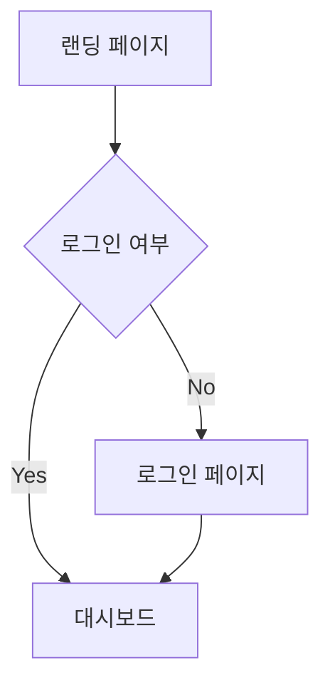

# Phase 4: 디자인 / 프로토타입 (Design & Prototype)

사용자 경험을 설계하고 시각적 프로토타입을 만든다. 코드 작성 전 검증 단계.

## 필수: Plan → Review → Execute → Re-verify

**이 Phase를 시작하기 전에 반드시 거버넌스 프로세스를 따른다.**

1. **PLAN** — 실행계획서를 작성한다 (`governance` 스킬의 `references/execution-plan-template.md` 참조)
   - 해당 Phase의 `docs/` 디렉토리에 `execution-plan.md`로 저장
   - 목표, 범위, 실행 단계, 성공 기준을 구체적으로 기술
2. **REVIEW** — 실행계획서를 사용자에게 제시하고 명시적 수락을 받는다
   - 승인(Approved) → 실행 절차로 진행
   - 수정 요청(Revise) → 계획 수정 후 재검증
   - 거부(Rejected) → 근본적 재설계
3. **EXECUTE** — 수락된 계획에 따라 아래 실행 절차를 수행한다
4. **RE-VERIFY** — 실행 완료 후 산출물과 결과를 재검증한다
   - 성공 기준 대비 달성 여부 확인
   - 산출물 완결성 및 이전 Phase와의 정합성 검증
   - 교훈(Lessons Learned) 기록
   - 통과(Pass) → 다음 Phase 진행 / 미달(Fail) → 보완 실행 또는 계획 재수립

> ⚠️ 실행계획 수립과 수락 없이 실행에 들어가지 않는다. 실행 후 재검증 없이 다음 Phase로 넘어가지 않는다.

## 전제 조건
- Phase 2의 유저 스토리 (`docs/02-planning/user-stories.md`)
- Phase 3의 API 설계 (`docs/03-architecture/api-spec.md`)

## 실행 절차

### Step 1: 정보 구조 (IA) 설계
1. **사이트맵 / 화면 목록** — 전체 페이지/화면 구조
2. **네비게이션 구조** — 메뉴, 라우팅 체계
3. **사용자 흐름 (User Flow)** — 핵심 태스크의 단계별 흐름

사용자 흐름은 Mermaid flowchart로 작성:

### Step 2: 와이어프레임
텍스트 기반 와이어프레임(ASCII 또는 구조 설명)으로 각 화면의 레이아웃을 정의:

1. **레이아웃 그리드** — 컬럼, 영역 구분
2. **핵심 요소 배치** — 헤더, 사이드바, 콘텐츠, 액션 영역
3. **상호작용 포인트** — 버튼, 폼, 모달 등 인터랙션 지점
4. **반응형 고려사항** — 모바일/태블릿/데스크톱 변화

### Step 2.5: 인터랙션 명세서 작성
Claude Code는 텍스트 기반 에이전트이므로, 시각적 디자인보다 UI/UX 인터랙션을 구조화된 명세로 정의하여 Phase 5 구현의 입력으로 전달:

1. **화면별 인터랙션 명세** — `references/interaction-spec-template.md` 기반
   - 화면 개요, 레이아웃 구조, 반응형 브레이크포인트
   - 컴포넌트 명세 (props, states, events, validation, accessibility)
   - 인터랙션 흐름 (사용자 동작 → 시스템 반응)
   - 상태 관리 (어떤 상태를 언제 변경하는지)
   - API 연동 정보
   - 에러 및 엣지 케이스 처리
   - 애니메이션 및 트랜지션

2. **산출물** — 각 화면마다 `docs/04-design/interaction-specs/[화면ID].md` 생성

> 인터랙션 명세서는 Phase 5에서 개발자가 코드를 구현할 때 참고하는 구체적인 입력 문서로, 와이어프레임보다 더 상세한 동작 명세를 포함한다.

### Step 3: 디자인 시스템 정의
코드로 관리 가능한 디자인 토큰과 컴포넌트 규칙:

1. **색상 팔레트** — Primary, Secondary, Neutral, Semantic (success/warning/error)
2. **타이포그래피** — 폰트 패밀리, 크기 스케일, 행간
3. **간격 (Spacing)** — 4px 또는 8px 기반 시스템
4. **컴포넌트 목록** — Button, Input, Card, Modal 등 재사용 컴포넌트
5. **상태 정의** — Default, Hover, Active, Disabled, Error, Loading

### Step 4: 프로토타입 구현
HTML/CSS 또는 React로 핵심 화면의 인터랙티브 프로토타입을 만든다:

1. 핵심 유저 플로우 1-2개를 선택
2. 클릭 가능한 프로토타입 구현 (실제 로직 X, 화면 전환만)
3. 반응형 레이아웃 적용
4. 디자인 토큰을 CSS 변수로 정의

### Step 6: 산출물 생성
- **`docs/04-design/sitemap.md`** — 정보 구조 및 화면 목록
- **`docs/04-design/user-flows.md`** — 사용자 흐름도
- **`docs/04-design/design-system.md`** — 디자인 시스템 정의
- **`docs/04-design/wireframes.md`** — 와이어프레임
- **`docs/04-design/interaction-specs/`** — 인터랙션 명세서 (화면별)
- **`prototype/`** — 프로토타입 코드 (선택)

## 가이드라인

- Mobile First — 모바일부터 설계하고 확장
- 접근성 (a11y)을 처음부터 고려: 색상 대비, 키보드 내비게이션, ARIA
- 완벽한 디자인보다 빠른 검증 — lo-fi에서 시작하여 점진적으로 hi-fi로
- 디자인 토큰은 코드 변수로 관리 (CSS custom properties, tailwind config)
- 컴포넌트는 Atomic Design 원칙: Atoms → Molecules → Organisms → Templates → Pages

## 참고 자료

- **`references/design-system-template.md`** — 디자인 시스템 정의 템플릿
- **`references/accessibility-checklist.md`** — 접근성 체크리스트
- **`references/interaction-spec-template.md`** — UI/UX 인터랙션 명세서 템플릿
